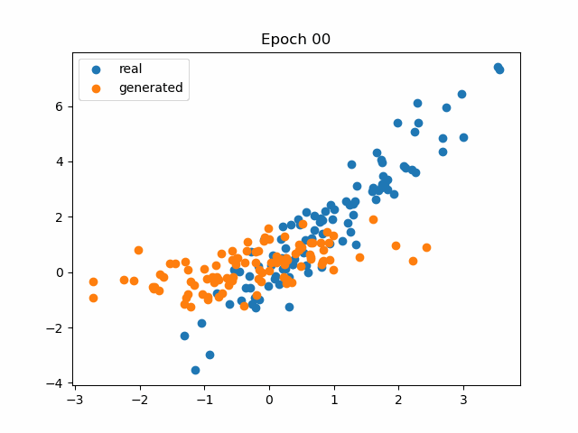

# Generative Adversarial Networks (GAN)

Original paper: [Generative Adversarial Networks](https://arxiv.org/abs/1406.2661)

---

## Theory

GANs are unsupervised models that aim to generate new samples that are indistinguishable from a set of examples. Unlike probabilistic models, GANs do not build a probability distribution and cannot evaluate the probability of a new data point belonging to the same distribution.

A GAN is composed of two models: the **generator** and the **discriminator**.  
The generator creates new samples by mapping random noise to the output data space.  
The discriminator evaluates whether a sample is real or generated. This ensures that the generated samples are plausible. A strong discriminator provides a training signal that can be used to improve the quality of the generated samples.

## Discrimination as a signal

The goal of the generator is to produce new samples that are statistically indistinguishable from the real data. We denote $\{x_i, y_i\}$ the real dataset.  
Let $x_j$ denote a real sample drawn from the training data. The generator produces a corresponding generated sample $x_j^*$ by mapping a random variable $z_j$ through the generator $g$ ($G$) with parameters $\theta$:  

$$
x_j^* = g[z_j, \theta]
$$

The training objective is to find parameters $\theta$ such that $x_j^*$ closely resembles $x_j$.  
The discriminator $f[\cdot, \phi]$ ($D$) must classify its input as either a real example or a generated one.  

The generator $G$ and the discriminator $D$ play a two-player minimax game:

$$
\min_G \max_D V(D, G)
$$

$$
V(D, G) = \mathbb{E}_{x \sim p_{\text{data}}}[\log D(x)] + \mathbb{E}_{z \sim p_z}[\log (1 - D(G(z)))]
$$

### Optimizing the generator and discriminator

- **Optimizing the generator**:

$$
\min \left[ \log(1 - D(G(z))) \right]
$$

The generator tries to fool the discriminator by making its generated samples $G(z)$ look as real as possible.

- **Optimizing the discriminator**:

$$
\max \left[ \log(D(x)) \right]
$$

The discriminator tries to correctly classify real data as real, while:

$$
\max \left[\log (1 - D(G(z)))\right]
$$

corresponds to the discriminator trying to correctly classify generated samples as fake.

We assume real example $x$ has label $y=1$ and generated example $x$ has label $y=0$.  
The discriminator $D$ performs binary classification:

$$
\hat{\phi} = \underset{\phi}{\arg\min} \left[ - \sum_i (1-y_i) \log \left[1 - \text{sig}(f[x_i, \phi])\right] - y_i \log [\text{sig}(f[x_i, \phi])] \right]
$$

Where $\text{sig}$ is the sigmoid function.  

By denoting indices $j$ as generated samples and $i$ as real examples:

$$
\hat{\phi} = \underset{\phi}{\arg\min} \left[ - \sum_j \log \left[1 - \text{sig}(f[x_j^*, \phi])\right] - \sum_i \log [\text{sig}(f[x_i, \phi])] \right]
$$

Using $x_j^* = g[z_j, \theta]$, we have:

$$
\hat{\theta} = \underset{\theta}{\arg\max} \left[ \min \left[ - \sum_j \log \left[1 - \text{sig}(f[g[z_j, \theta], \phi])\right] - \sum_i \log [\text{sig}(f[x_i, \phi])] \right] \right]
$$

We recover:

$$
V(D, G) = - \sum_j \log \left[1 - \text{sig}(f[g[z_j, \theta], \phi])\right] - \sum_i \log [\text{sig}(f[x_i, \phi])]
$$

Optimizing $D$ on a finite set may lead to overfitting.  
A solution is to alternate between $k$ steps of optimizing $D$ and one step of optimizing $G$, effectively using a lower learning rate for the generator.

### Loss functions

The loss functions to train a GAN are:

$$
L[\phi] = - \sum_j \log \left[1 - \text{sig}(f[g[z_j, \theta], \phi])\right] - \sum_i \log [\text{sig}(f[x_i, \phi])]
$$

$$
L[\theta] = \sum_j \log \left[1 - \text{sig}(f[g[z_j, \theta], \phi])\right]
$$

In practice, rather than training $G$ to minimize $\log [1 - D(G(z))]$, we can train $G$ to **maximize** $\log(D(G(z)))$, because $\log[1 - D(G(z))]$ saturates. This provides stronger gradients early in training, when $G$ is poor and $D$ can reject samples with high confidence.

The solution of $\min_G \max_D V(D, G)$ is a **Nash equilibrium**, a position that is simultaneously a $\min$ of one function and a $\max$ of the other function.

## Results
This is the evolution of samples generated from a fixed noise vector after each epoch.

